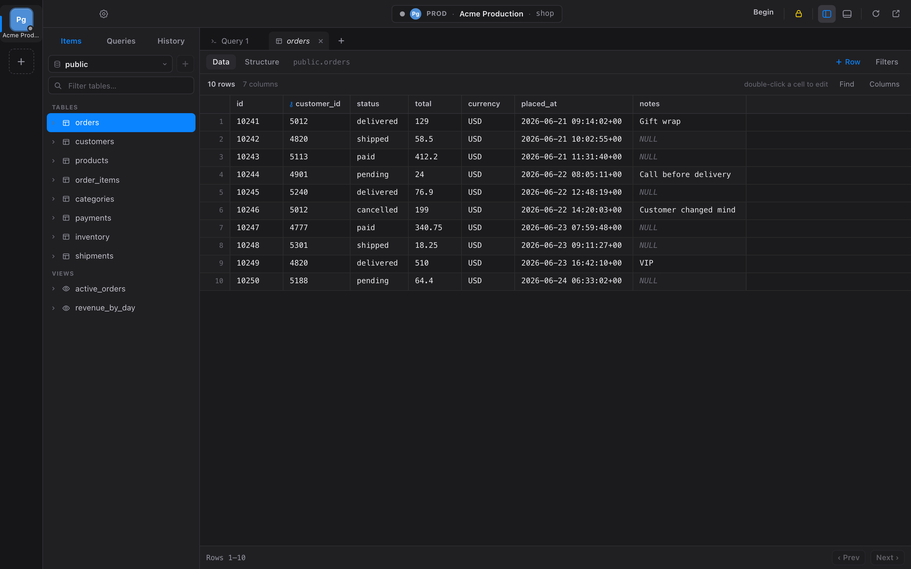
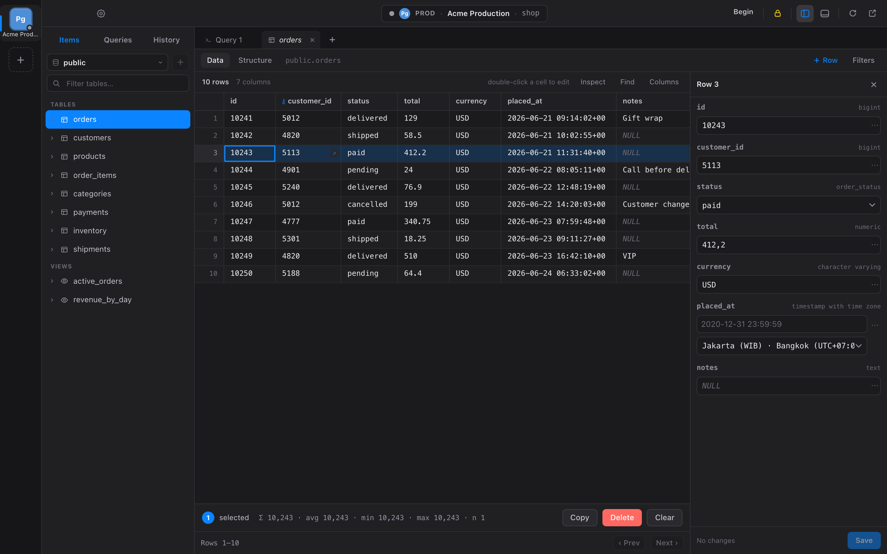
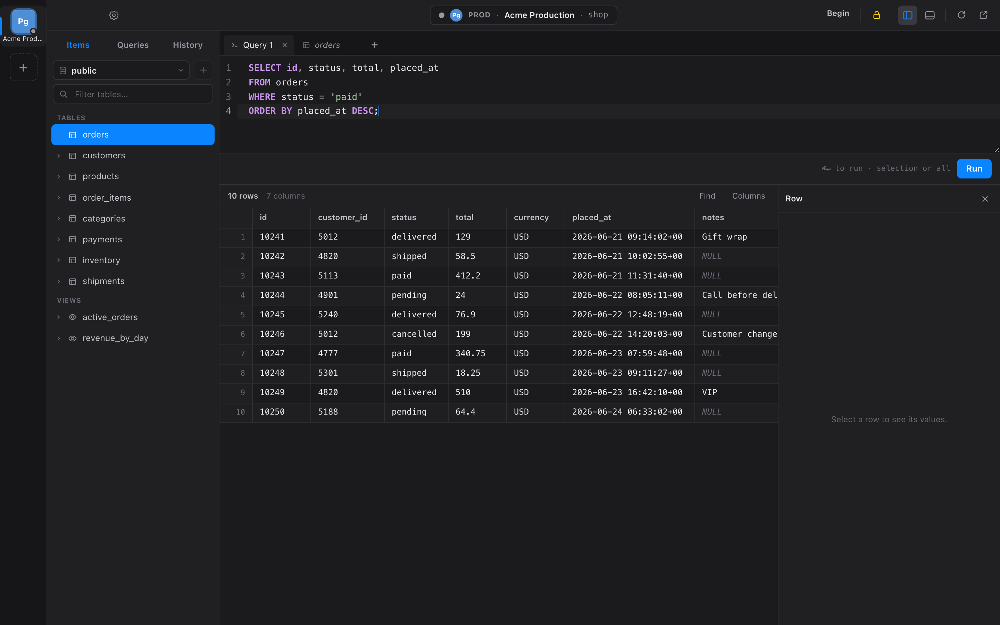
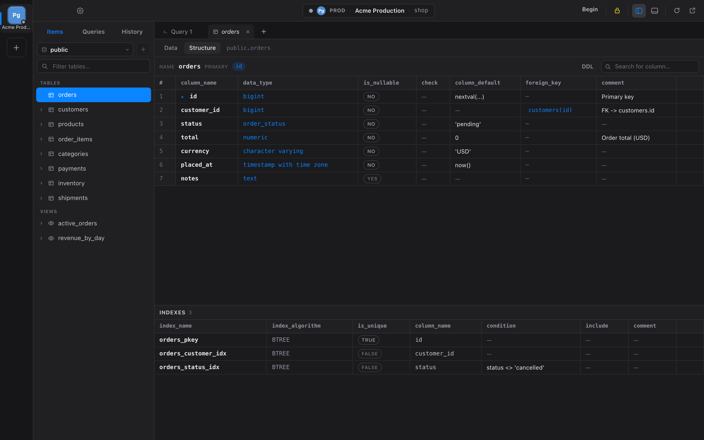

# Kueri

**A fast, native, open-source multi-database GUI client.**

One calm, keyboard-first interface for every database, powered by a single Rust `Driver` abstraction. Built with Tauri for a lightweight footprint, native performance, and a consistent experience across every supported database.


<p align="center">

**[Download](https://github.com/umarta/kueri/releases/latest) •
[Features](#features) •
[Screenshots](#screenshots) •
[Install](#install) •
[Architecture](#architecture) •
[Contributing](#contributing)**

</p>

---



> [!NOTE]
> Kueri is under active development. PostgreSQL, MySQL/MariaDB, and SQLite are ready for daily use. SQL Server, Redis, and MongoDB are planned.

## Why Kueri?

Most database clients are either heavy (Electron/Java), commercial, or inconsistent across database engines.

Kueri focuses on a different philosophy:

* 🚀 **Native performance** — built with Tauri using the system WebView.
* ⌨️ **Keyboard-first workflow** — almost everything can be done without touching the mouse.
* 🧩 **One abstraction** — every relational database shares the same UI through a single Rust `Driver` trait.
* 🔒 **Safe by default** — OS keychain, production read-only mode, PK-aware updates.
* ❤️ **Fully open source** — no feature paywalls.

---

# Features

### Connect

* Multiple workspaces & session restore
* SSL/TLS + optional SSH tunnel
* Passwords stored securely in the OS keychain
* Connection groups, colors and tags

### Browse & Edit

* Virtualized data grid
* Inline editing + row detail panel
* Type-aware editors
* FK navigation
* Filtering without SQL
* PK-aware updates
* Read-only mode

### SQL Editor

* CodeMirror editor
* Autocomplete
* SQL formatting
* Multi-statement execution
* Transaction controls
* Query history
* Saved queries
* Visual EXPLAIN (PostgreSQL)

### Database Structure

* Table designer
* Columns & indexes
* Foreign keys
* DDL viewer
* Create / rename / drop objects
* Server monitor

### Import / Export

* Native SQL export
* pg_dump / pg_restore
* mysqldump
* CSV import

---

# Screenshots

### Browse & Edit


### Row Detail



### SQL Editor



### Structure



---

# Supported Databases

| Database        | Status     |
| --------------- | ---------- |
| PostgreSQL      | ✅ Stable   |
| MySQL / MariaDB | ✅ Stable   |
| SQLite          | ✅ Stable   |
| SQL Server      | 🚧 Planned |
| Redis           | 🚧 Planned |
| MongoDB         | 🚧 Planned |

---

# Install

Download the latest release for your platform.

**➡ https://github.com/umarta/kueri/releases/latest**

See the platform-specific installation guide below.

<details>

<summary><b>macOS</b></summary>

* Apple Silicon & Intel builds available
* Unsigned binary (right-click → Open on first launch)

</details>

<details>

<summary><b>Windows</b></summary>

* MSI & EXE installer
* SmartScreen confirmation may appear

</details>

<details>

<summary><b>Linux</b></summary>

* AppImage
* DEB
* RPM

</details>

---

# Keyboard Shortcuts

| Shortcut | Action        |
| -------- | ------------- |
| ⌘P       | Open anything |
| ⌘↵       | Run query     |
| ⇧⌘F      | Format SQL    |
| ⌘S       | Commit        |
| ⌘I       | Insert row    |
| ⌘D       | Duplicate row |
| ⌘.       | Cancel query  |
| ⌘,       | Settings      |

See the full shortcut list inside the application.

---

# Architecture

```text
Svelte
      │
      ▼
Tauri Commands
      │
      ▼
Driver Trait
      │
 ┌────┼────┐
 ▼    ▼    ▼
Postgres
MySQL
SQLite
```

Every database driver implements the same `Driver` trait, allowing the UI and Tauri commands to remain completely database-agnostic.

<details>

<summary><b>Project Layout</b></summary>

```text
src/
src-tauri/
docs/
scripts/
```

</details>

---

# Roadmap

Kueri is under active development. The list below is what's shipped, what's next, and what's on the horizon — see [issues](https://github.com/umarta/kueri/issues) for the full plan and to weigh in on priorities.

### Shipped

* [x] Postgres / MySQL / MariaDB / SQLite drivers behind a unified `Driver` trait
* [x] Inline editing
* [x] SSH tunnels (basic)
* [x] Transactions
* [x] Native backup
* [x] Server monitor

### Next up

* [ ] CodeMirror 6 editor — schema-aware autocomplete, SQL formatter, first-class query parameters
* [ ] Grid stage/commit with undo/redo and SQL preview panel
* [ ] Safe Mode — six per-connection protection levels (warn → read-only)
* [ ] Password sources — OS keychain + 1Password, HashiCorp Vault, AWS Secrets Manager, env vars
* [ ] SSL/TLS connection settings per driver
* [ ] SSH tunneling with reusable profiles (one bastion → many DBs)
* [ ] Command palette (⌘P) — fuzzy search across connections, tables, queries, actions
* [ ] Persistent query history with full-text search
* [ ] Favorites — pinned tables and saved queries
* [ ] Rich cell viewers (JSON tree, hex, image preview) + per-column display formats
* [ ] AI assistant — chat, inline SQL generation, explain/optimize/fix (bring-your-own-key)

### Later

* [ ] Plugin architecture — external drivers, import/export formats, themes
* [ ] MCP server — expose connections to Claude Desktop, Cursor, and other LLM clients
* [ ] Vim mode in the SQL editor
* [ ] EXPLAIN visualization — interactive query plan tree
* [ ] ER diagram — visual schema with pan/zoom
* [ ] Schema diff / structure sync between databases
* [ ] Data transfer — copy tables/data between connections
* [ ] Data generation — plausible fake rows per column type
* [ ] Server dashboard — live connections and activity
* [ ] Charts / data visualization on result sets
* [ ] Backup scheduling & automation (pg_dump / mysqldump / SQL / CSV / XLSX)
* [ ] Import wizard — Excel / JSON / SQL file
* [ ] Export — Excel / HTML / Markdown
* [ ] Table info panel (size, rows, encoding)
* [ ] Constraints (CHECK / UNIQUE) editor + functions & triggers editor
* [ ] Multiple windows
* [ ] Session restore — tabs + workspace snapshot per connection
* [ ] Connection import / export / duplicate
* [ ] Open Project Folder — auto-detect connections from `.env` / `docker-compose.yml`
* [ ] `kueri://` URL scheme for external integrations

### On the horizon

* [ ] SQL Server driver
* [ ] MongoDB + Redis (separate non-tabular UI mode)
* [ ] Users & Roles management (Postgres / MySQL) with staged privilege changes

---

# Contributing

Bug reports, feature requests and pull requests are always welcome.

If Kueri improves your daily workflow, consider giving the repository a ⭐.

---

# License

MIT © Kueri Contributors
